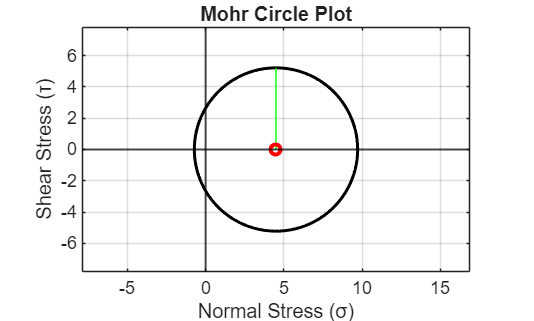
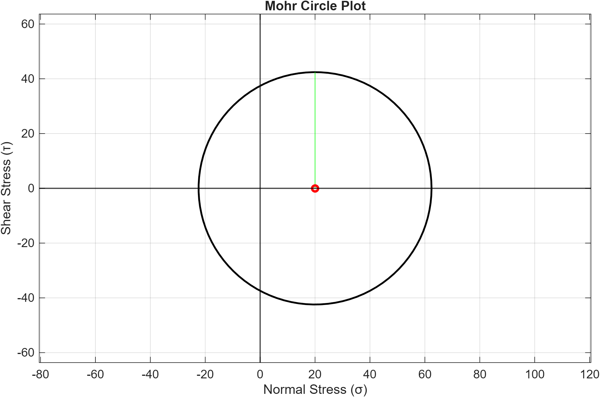

<a id="TMP_45cf"></a>

# Mohr Circle Stress Calculator 
<!-- Begin Toc -->

## Table of Contents
&emsp;[User Defined Stress Inputs](#TMP_94ff)
 
&emsp;&emsp;[Analysis of Stress Inputs](#TMP_261f)
 
&emsp;[Plot Results](#TMP_0951)
 
&emsp;&emsp;[Mohr's Circle Plot Using Test Values](#TMP_6c10)
 
&emsp;[Output Display](#TMP_88cd)
 
&emsp;[User\-Controlled Loop](#TMP_65e3)
 
&emsp;[Final Conclusion](#TMP_4db1)
 
<!-- End Toc -->
<a id="TMP_94ff"></a>

# User Defined Stress Inputs

The program asks the user to enter values for the stress in the x direction, the stress in the y direction, and the shear stress. Inputs are stored as **sigmax**, **sigmay**, and **shear**, respectively.

```matlab
repeat='y';                 %repeat equals 'y' helps supports the while loop in line 2 
while strcmp(lower(repeat),'y')
sigmaX=input('Enter sigma x (stress in x direction, MPa): ');
while isempty(sigmaX)       %while used so sigma X can't be no input 
    sigmaX = input('Enter sigma x (stress in x direction, MPa): ');
end
sigmaY=input('Enter sigma y (stress in y direction, MPa): ');
while isempty(sigmaY)       %while used so sigma Y can't be no input 
    sigmaY = input('Enter sigma y (stress in y direction, MPa): ');
end
shear=input('Enter the shear stress (MPa): ');
while isempty(shear)        %while used so shear can't be no input 
    shear=input('Enter the shear stress (MPa): ');
end
```
<a id="TMP_261f"></a>

## Analysis of Stress Inputs 
<a id="TMP_2249"></a>

Converts stress inputs into the radius and x/y coordinates of the Mohr Circle

-  Converts the user\-supplied stress inputs, storing the x\-coordinate of the circle's center as avgsigma, determined by averaging the stresses in the x and y directions, which are stored as **sigmaX** and **sigmaY**, respectively 
-  Using the user\-supplied stress inputs, **sigmaX**, **sigmaX** combined with the shear stress stored as **shear**, the radius of the circle can be determined, defined as **R** 
-  **Theta** is stored as an angle from 0\-2π to complete one full loop of the circle 
-  Using the equation of the circle, the x and y components of the circle can be defined as (**xcoord, ycoord**), solved for by using the radius, angle, and center of the circle. 
```matlab
avgsigma=(sigmaX+sigmaY)/2;
R=sqrt(((sigmaX-sigmaY)/2)^2+(shear)^2);
theta=linspace(0,2*pi);
xcoord=R*cos(theta)+avgsigma;
ycoord=R*sin(theta)+0;
```
<a id="TMP_0951"></a>

# Plot Results
```matlab
plot(xcoord,ycoord,'k','LineWidth',1.5)             %plot of the Mohr's Circle 
hold on
plot([avgsigma,avgsigma],[0,R],'g')                 %plot of radius line 
plot(avgsigma,0,'ro','MarkerSize',5,'LineWidth',2)  %plot of center  
```



Annotate the plot

```matlab
hold off
grid on 
xlabel('Normal Stress (σ)')
ylabel('Shear Stress (τ)')
axis equal
xline(0,'k','LineWidth',1)
yline(0,'k','LineWidth',1)
ylim([-1.5*R,1.5*R])
title('Mohr Circle Plot')
```
<a id="TMP_6c10"></a>

## Mohr's Circle Plot Using Test Values

Test values: (σx=50, σy=\-10, τxy=30)




<a id="TMP_88cd"></a>

# Output Display 

After the Mohr's circle is plotted, the program displays the circle's center coordinates and radius, then displays a confirmation message that the circle has been plotted.

```matlab
fprintf('The center of the circle is at (%g,%d)\n',[avgsigma;0])
disp(['The Radius of the circle is ',num2str(R)])
disp('The Mohr Circle is plotted')
```

```matlabTextOutput
The center of the circle is at (4.5,0)
The Radius of the circle is 5.2202
The Mohr circle is plotted
```

<a id="TMP_65e3"></a>

# User\-Controlled Loop

The program allows the user to decide whether they would like to run the program again to generate a new Mohr's Circle, restarting the program.

```matlab
repeat=input('Do you want to continue?(Y/N): ','s');
repeat=lower(repeat); 
while isempty(repeat) | ~strcmp(lower(repeat),'y')
if strcmp(lower(repeat),'n')       
    break 
end
    repeat=input('Do you want to continue?(Y/N): ','s');
end
end
```
<a id="TMP_4db1"></a>

# Final Conclusion 

In conclusion, the program demonstrates how shear stresses can be used to graph a Mohr's Circle, which provides better visualization and serves as a visual, intuitive way to understand normal and shear stresses as the material plane rotates, only requiring three variables to run.

